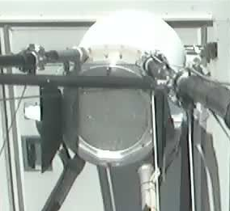
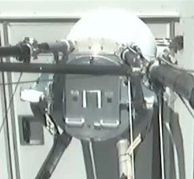
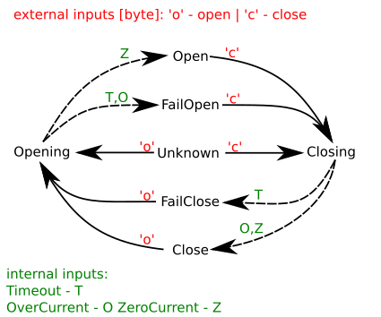

### The FACT Lid

The FACT camera front window is mounting platform and protection layer for the 1440 photon sensors. 
For optimal optical coupling and reduced mechanical complexity the SiPM are directly coupled via their 
injection moulded light guides (winston cones) using dedicated UV hardening glue. 
The window as well as the winston cones consists of PMMA, which is subject to ageing in case of 
prolonged illumination by [strong sunlight][Torikai]. In addition to adverse effects of direct sunlight windspeeds of up to 200 km/h have been measured at the telescope site. Such wind combined with sand grains can cause a significant reduction in the optical transmission of a PPMA surface.

Therfore it is necessary to cover the FACT camera window with a protecting Lid. 
The FACT Lid is depicted below.
 

It consists of two semicircular aluminum sheets movable by two LINAK LA66 actuators.
The actuators are powered with 24V and controlled 
using an [Arduino Ethernet](https://www.arduino.cc/en/Main/ArduinoBoardEthernet) 
with a (slightly modified) [Pololu Dual Motor Driver](https://www.pololu.com/product/2502) shield.

Each LA66 actuator is equipped with two endswitches and a hall sensor based position readout. 
The position is encoded as a DC voltage level between 0 and 5V subsequently 
transmitted via ~50m cable to the lidcontroller situated inside the FACT counting hut, parallel to the supply lines.
Over the long line parallel to the power supply lines a lot of noise and 
crosstalk is collected on the position encoding lines. 
In order to mitigate this effect the designer of the 
electronics Vittorio Boccone designed a dedicated filter and aplifier, which is also provided as an arduino shield.

## Novelties in 2017

Between the original installation of the Lid actuators in summer 
2012 and the time of this wirting spring 2017 the actuators had to be replaced several times. 
One Actuator has been studied and has been found to be completely oxidized due to moisture.

In summer 2016 the hall sensors of the last pair of actuators failed, resulting additional downtime of the instrument.
Studies have shown that a precise position measurement is not necessary as for the standard operation of the lid, the acturators are either completely contracted until the endswitches trigger (open state) or the are completely extended until either and endswitch is hit or the lids are pressed firmly agains the camera frame resulting in and "overcurrent" condition (closed state).

### Lid Arduino

Note:  device file `/dev/ttyACM0` is not unique, access the arduino better by e.g. this:

    /dev/serial/by-id/usb-Arduino__www.arduino.cc__Arduino_USB-Serial_6493633313735151B0D1-if00

or by the symlink Max Noethe has made:

    /dev/lid-arduino

# We are using platformio

http://docs.platformio.org/en/stable/what-is-platformio.html

Simply since we can develop our arduinos remotely an X-server. Since platformio is still only python 2 compliant, we propose to install it like this:

## Install Anaconda (shame, if you haven't yet)

## Create a python 2.7 enviroment

    conda create --name py27 python=2.7

## Activate the python 2.7 environmen, if you've allready created it

    source activate py27

## Install platformio

    pip install platformio

## build and upload with

    cd Software/ShutterController/
    platformio run -t upload

## connect to serial monitor with

    cd Software/ShutterController/
    platformio device monitor -p /dev/lid-arduino -b 115200

# platformio.ini contents:

    [env:ethernet]
    platform = atmelavr
    board = ethernet
    framework = arduino
    upload_port = /dev/lid-arduino

[Torikai]: http://link.springer.com/chapter/10.1007%2F978-1-4899-0112-5_50  "Torikai, Ayako. 'Wavelength Sensitivity in the Photo-Degradation of Polymethyl Methacrylate: Accelerated Degradation and Gel Formation.' Science and Technology of Polymers and Advanced Materials. Springer US, 1998. 581-586."

